# 图像三维处理的深度学习探讨

到目前为止，本项目主要包括以下内容：
1. 使用深度学习技术对建筑物进行完整的三维重建，无死角、无畸变。
2. 结合计算机视觉课程知识，识别并计算出楼层数目、最高高度、最宽宽度、
最长长度、窗户数目、窗户面积、整个建筑的体积（立方米数）。
3. 识别并计算楼宇外围物体的数目，比如树木、垃圾箱、灯杆、空调外挂机等等。

## 一、三维重建

### 综述

我们的项目的三维重建部分主要参考了[colmap](http://colmap.github.io/)、[patchmatchnet](https://github.com/FangjinhuaWang/PatchmatchNet)的论文与代码。
我们运用深度学习策略对图像的三维重建主要包括以下步骤：
1. 对图像取特征点(特征提取)
2. 特征点匹配
3. 去除错误匹配点
4. `sfm`恢复相机位姿
5. 稠密重建（也称`mvs`）。
    1.  我们首先尝试传统的稠密重建策略，利用patchmatch算法进行处理；
    2.   之后再使用深度学习方法，我们采用`patchmatchnet`，`CVP-MVSNet`等算法进行处理。

我们实际操作的过程如下：
1. `colmap`处理。我们发现对上面所提到的前4步来讲，深度学习没有太大的优势且效果不尽如人意，于是沿用了传统的处理方式，在对图片进行初步的预处理之后，用`colmap`（`cuda`版）对图像进行处理并进行稀疏重建。
`colmap`中提供了利用传统的`patchmatch`算法进行`dense`重建的选项，为与深度学习对比效果起见，我们也花了一些时间进行传统方法的稠密重建并得出结果。

2. `patchmatchnet`等算法的稠密重建。之后我们参考`patchmatchnet`的代码，利用得到的数据进行稠密重建。
    1. 我们先将我们的数据修改好格式之后，代入`patchmatchnet`代码的作者给出的模型，进行初步的三维重建，这一步因为运算规模较小，所以我们在个人PC上调试成功之后再移植到集群上继续运行；需要注意的一点是，鉴于`patchmatchnet`的源代码要求`cuda`环境而负责本步骤的组员的电脑不支持`cuda`，于是我们将代码改写为可以选择性运行`cuda`或者`cpu`的版本。
    2. 之后我们下载`dtu`数据集，在集群上进行模型的训练，并将上面处理到的数据代入训练出的模型再次尝试进行稠密重建；
    3. 在`patchmatchnet`算法得出结果之后，我们又尝试了`CVP-MVSNet`等算法.
3. 模型处理与表面重建。我们剪裁了一下建筑物周边的数据并利用`meshlab`等第三方软件对数据进行表面重建。


### 如何运行

#### 环境配置

我们项目采用pytorch环境，依赖包的安装:
```
pip install -r requirements.txt
```

#### Custom_Evaluation

如果您想用个人的数据代入已知模型查看三维重建的结果，我们建议您在colmap图形化工具中进行automatic reconstruction。

如果您的电脑支持cuda环境，那么我们建议您勾选``dense model``；但勾选与否不影响我们之后的处理过程。
之后，``export model as text``在工作目录的``sparse1``文件夹(请自主创建)下，生成``cameras.txt``、``images.txt``、``points3D.txt``
```
sfm
├──img（您要处理的图片）
├──sparse
├──sparse1
    ├── cameras.txt  
    ├── images.txt   
    └── points3D.txt                                       
    
```
之后我们将项目代码中的``colmap_input.py``文件复制到``sfm``工作目录下并运行，新生成如下内容：
```
sfm
├── images                 
│   ├── 00000000.jpg       
│   ├── 00000001.jpg       
│   └── ...                
├── cams                   
│   ├── 00000000_cam.txt   
│   ├── 00000001_cam.txt   
│   └── ...                
└── pair.txt  
```
我们将上述三部分内容放入项目文件夹的``data``目录下：
```
root directory
├── data                 
│   ├── scan1       
│       ├── cams
        ├── images
        └── pair.txt          
```
于是我们可以开始准备运行了。
如果您自主选择了文件路径，请根据个人情况修改eval.sh；
您可以根据您的情况修改``datasets/custom.py``以及``eval_custom.py``中`img_wh`的值（须被8整除）
设置好之后，通过在终端中键入`sh eval.sh`运行。
倘若您使用windows系统，请在``eval_custom.py``中修改相应参数并直接运行该文件。
生成的结果结构如下所示：
```
outputs_custom
├── confidence                 
│   ├── 00000000.jpg       
│   ├── 00000001.jpg       
│   └── ...                
├── depth_est                   
│   ├── 00000000_cam.txt   
│   ├── 00000001_cam.txt   
│   └── ... 
├── mask                   
│   ├── 00000000_final.png 
│   ├── 00000000_geo.png
│   ├── 00000000_photo.png
│   ├── 00000001_final.png
│   └── ...              
└──  custom.ply
```
其中``custom.ply``即三维重建的点云文件，也即处理后的最终结果，可以使用`colmap`或`meshlab`等软件进行查看或编辑。
我们提供了在集群上用`conda`创建虚拟环境、安装所需模块、运行上述过程的脚本（``eval_cluster.sh``）作为补充；对于可运行cuda的集群，本代码可以并行化运行。

#### 训练模型
 
本代码采用[DTU数据集](https://polybox.ethz.ch/index.php/s/ugDdJQIuZTk4S35)进行训练，数据集格式如下：
```
root_directory
├──Cameras_1
├──Rectified
└──Depths_raw
```
请在下载数据集之后，将``train.sh``中`MVS_TRAINING`改为您的数据集存储路径，并依照您的需要设置`log_dir`（这将是模型结果储存的路径）。

### 运行结果

点云数据的`colmap`与`patchmatchnet`处理结果：

[colmap处理结果](https://pan.baidu.com/s/11UaJ74vQcnfFC1q9BU78cw) (提取码:og6y)

[patchmatchnet处理结果](https://pan.baidu.com/s/11JwJ-VMgWA8e3S2JQCxZTg) 提取码：aldz

我们裁去了最终模型结果中的周边景物，只保留建筑物的结果，得到[最终点云结果](https://pan.baidu.com/s/1oLG-bYXIlJfpmT9IiWpk3w 
)(提取码：6286)，点云截图如下所示：


题目要求：结合计算机视觉课程知识，识别并计算出楼层数目、最高高度、最宽宽度、最长长度、窗户数目、窗户面积。

## 二、计算建筑物尺寸与识别楼层、窗户的数量，计算窗户数量与面积

### 1、计算楼层最高高度、最宽宽度、最长长度

##### 1）选取参照物（本例中选择大门作为参照物），拍摄人站在参照物前的图像，根据人与参照物在图像中的比例，计算出参照物的真实尺寸（如大门的实际高度）。

加载图片，转成灰度图

```
image = cv2.imread("353.jpg")
gray = cv2.cvtColor(image, cv2.COLOR_BGR2GRAY)
```

用Sobel算子计算x，y方向上的梯度，之后在x方向上减去y方向上的梯度，通过这个减法，我们留下具有高水平梯度和低垂直梯度的图像区域。

```
gradX = cv2.Sobel(gray, ddepth=cv2.cv.CV_32F, dx=1, dy=0, ksize=-1)
gradY = cv2.Sobel(gray, ddepth=cv2.cv.CV_32F, dx=0, dy=1, ksize=-1)

gradient = cv2.subtract(gradX, gradY)
gradient = cv2.convertScaleAbs(gradient)
```

去除图像上的噪声。首先使用低通滤泼器平滑图像（9 x 9内核）,这将有助于平滑图像中的高频噪声。低通滤波器的目标是降低图像的变化率。如将每个像素替换为该像素周围像素的均值。这样就可以平滑并替代那些强度变化明显的区域。

然后，对模糊图像二值化。梯度图像中不大于90的任何像素都设置为0（黑色）。 否则，像素设置为255（白色）。

```
# blur and threshold the image
blurred = cv2.blur(gradient, (9, 9))
(_, thresh) = cv2.threshold(blurred, 90, 255, cv2.THRESH_BINARY)
kernel = cv2.getStructuringElement(cv2.MORPH_RECT, (25, 25))
closed = cv2.morphologyEx(thresh, cv2.MORPH_CLOSE, kernel)
closed = cv2.erode(closed, None, iterations=4)
closed = cv2.dilate(closed, None, iterations=4)
```

利用cv2.findContours()函数取得图像的轮廓。cv2.findContours()函数返回两个值，一个是轮廓本身，还有一个是每条轮廓对应的属性。使用cv2.minAreaRect()函数求得包含点集最小面积的矩形，这个矩形是可以有偏转角度的，可以与图像的边界不平行。

```
(cnts, _) = cv2.findContours(closed.copy(), cv2.RETR_EXTERNAL, cv2.CHAIN_APPROX_SIMPLE)
c = sorted(cnts, key=cv2.contourArea, reverse=True)[0]

# compute the rotated bounding box of the largest contour
rect = cv2.minAreaRect(c)
box = np.int0(cv2.cv.BoxPoints(rect))

# draw a bounding box arounded the detected barcode and display the image
cv2.drawContours(image, [box], -1, (0, 255, 0), 3)
cv2.imshow("Image", image)
cv2.imwrite("contoursImage2.jpg", image)
cv2.waitKey(0)
```

找出最上端、最下端、最左端、最右端的点，并以此计算门的长、宽：

```
Xs = [i[0] for i in box]
Ys = [i[1] for i in box]
x1 = min(Xs)
x2 = max(Xs)
y1 = min(Ys)
y2 = max(Ys)
hight = y2 - y1
width = x2 - x1
```

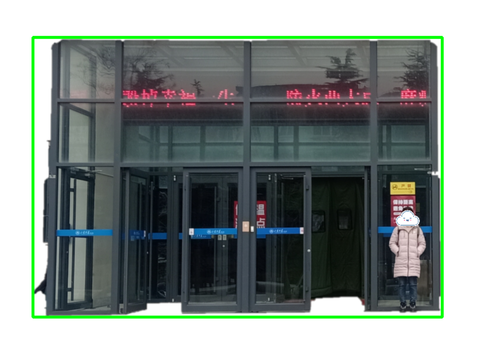

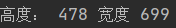

用同样的方法计算人在图像中的尺寸

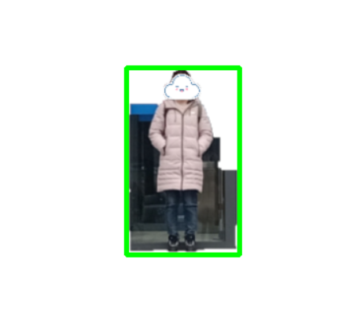

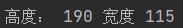

已知人的实际高度是170cm，计算人的实际高度/人的图像内高度，再用大门的图像内高度乘以这个比例，得到大门在实际中的高度。

```
per = 170/hight2
real_door = per * hight1
print(real_door)
```

得到门的实际高度（单位：cm）：

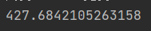

##### 2）根据建筑物整体的图像，计算参照物与建筑本身在那张图像上的高度和宽度，并根据参照物的实际高度与图像中高度的比例，求得建筑物的真实高度与宽度。

代码同上，得到结果如下：、

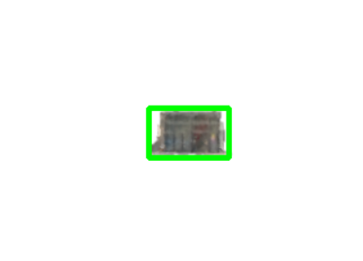

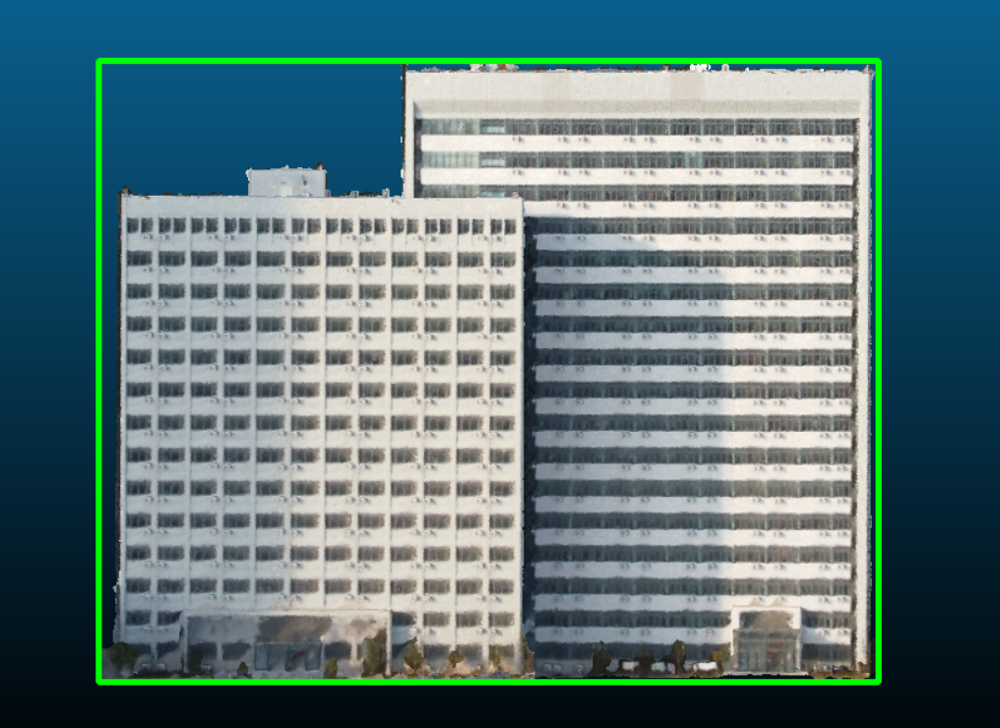

得到二者的尺寸分别为（单位：cm）：

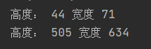

求得参照物实际高度（427.68cm）与图像上的高度的比值，分别用楼房在图像中的高度与宽度乘以这个比值，得到楼房的实际尺寸。

```
per = 427.68 / height1
real_height = per * height2
real_width = per * height2
print("楼房高度：",real_height,"楼房宽度",real_width)
```

得到楼房的真实尺寸（单位：cm）：

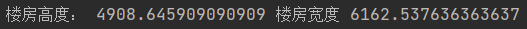

##### 楼房的长度、8号楼以及22号楼的尺寸可以用同样的方法得出，在此省略。


### 2、识别并计算窗户的数量、面积

```
import numpy as np
import cv2 as cv

font = cv.FONT_HERSHEY_SIMPLEX
```

定义识别函数，并以如下步骤实现要求的功能：

1、分别对图像进行高斯平滑、双边平滑处理图像

2、将图像转化成灰度图

3、得到轮廓，并使用cv.findContours()函数得到轮廓的几何形状

4、遍历所有轮廓，利用：

①边数是否大于等于4条

②面积是否大于50

③形状是否为凸的

三个条件识别轮廓中的矩形并计数

5、计算矩形的总面积，并计算矩形的平均面积

6、利用计算建筑比例时计算出的，同一张图中的，门的实际高度与图中高度的比例，得到窗户的实际面积

```
def find_squares(img):
    squares = []
    img = cv.GaussianBlur(img, (7, 7), 0)
    img = cv.bilateralFilter(img,3,7,7)
    gray = cv.cvtColor(img, cv.COLOR_BGR2GRAY)
    bin = cv.Canny(gray, 150, 100, apertureSize=3)
    contours, _hierarchy = cv.findContours(bin, cv.RETR_EXTERNAL, cv.CHAIN_APPROX_SIMPLE)
    index = 0
    # 轮廓遍历
    sum = 0
    for cnt in contours:
        cnt_len = cv.arcLength(cnt, True)  # 计算轮廓周长
        cnt = cv.approxPolyDP(cnt, 0.02 * cnt_len, True)  # 多边形逼近
        # 条件判断逼近边的数量是否为4，轮廓面积是否大于1000，检测轮廓是否为凸的
        if len(cnt) >= 4 and cv.contourArea(cnt)<1000 and cv.contourArea(cnt) > 50 and cv.isContourConvex(cnt):
            sum += cv.contourArea(cnt)
            M = cv.moments(cnt)  # 计算轮廓的矩
            cx = int(M['m10'] / M['m00'])
            cy = int(M['m01'] / M['m00'])  # 轮廓重心

            cnt = cnt.reshape(-1, 2)
            if True:
                index = index + 1
                cv.putText(img, ("#%d" % index), (cx, cy), font, 0.7, (255, 0, 255), 2)
                squares.append(cnt)
    print("窗户数量为：",index)
    sum = sum/index
    sum = 9.72 * 9.72 * sum
    print("窗户面积为：",sum)
    return squares, img
```

识别窗户的结果：

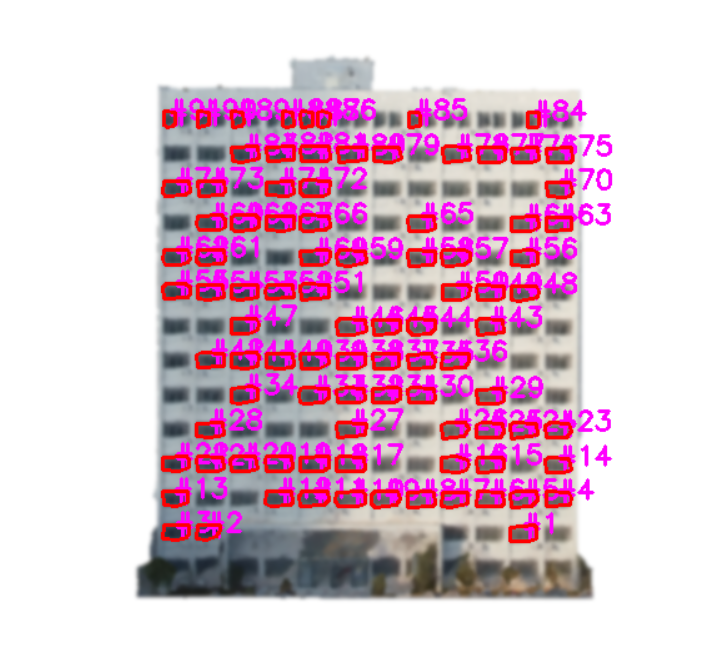

得到的计数结果、窗户面积为（单位分别为：个、平方厘米）：

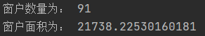

### 3、计算楼层的层数

```
import cv2 as cv
```

首先将图像转化为灰度图，再转化为二进制图像

```
def ToBinray():
    global imgray, binary
    # 1、灰度图
    imgray = cv.cvtColor(img, cv.COLOR_BGR2GRAY)
    cv.imshow('imgray', imgray)

    # 2、二进制图像
    ret, binary = cv.threshold(imgray, 127, 255, 0)
    # 阈值 二进制图像
    cv.imshow('binary', binary)
```

输出的灰度图为：

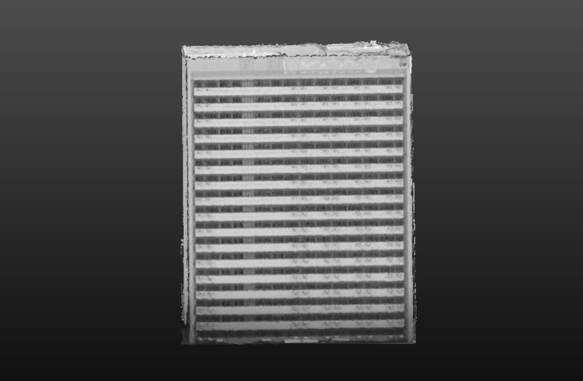

输出的二进制图为

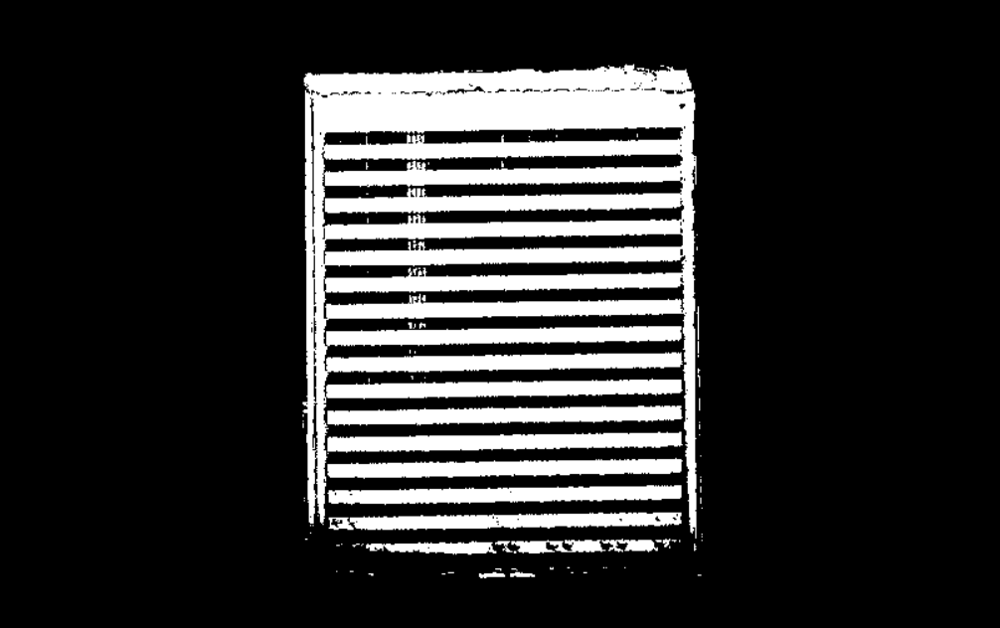

提取轮廓

```
def GetGontours():
    # 1、根据二值图找到轮廓
    contours, hierarchy = cv.findContours(binary, cv.RETR_TREE, cv.CHAIN_APPROX_NONE)
    # 轮廓      层级                               轮廓检索模式(推荐此)  轮廓逼近方法

    # 2、画出轮廓
    dst = cv.drawContours(img, contours, -1, (0, 0, 255), 3)
    #                           轮廓     第几个(默认-1：所有)   颜色       线条厚度

    cv.imshow('dst', dst)
```

结果为

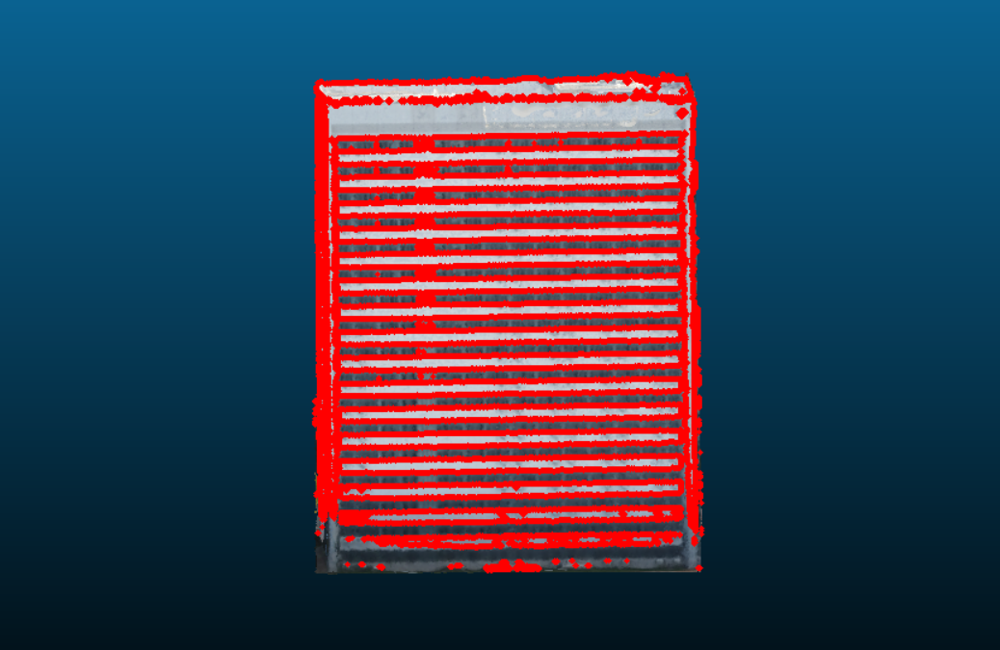

```
if __name__ == '__main__':
    img = cv.imread('24_2.png')
    cv.imshow('img', img)

    ToBinray()  # 转二进制

    GetGontours()  # 提取轮廓

    cv.waitKey(0)
```

依据同上一步中的，识别窗户的原理，计算出楼层数目为：

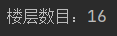

8号楼、22号楼的楼层数目方法同上。

## 三、3D点云目标检测

采用PVRCNN模型，PVRCNN源码被作者收集到Open-MMLab/OpenPCDet中。

[GitHub - open-mmlab/OpenPCDet: OpenPCDet Toolbox for LiDAR-based 3D Object Detection.](https://github.com/open-mmlab/OpenPCDet)

### Ⅰ 环境配置

由于PV-RCNN环境需要配置的内容较多，且大多数软件彼此之间有依赖性，在经历了多次尝试后最终决定使用nvidia docker。

#### 1.docker介绍

* 容器级别的虚拟化
* 不是基于硬件虚拟化
* 和宿主机共享操作系统内核和资源
* 轻量
* 方便的构建&部署应用程序
* 采用虚拟化控制

#### 2.Nvidia-docker介绍

docker原生并不支持在他生成的容器中使用Nvidia  GP资源。nvidia-docker是对docker的封装，提供一些必要的组件可以很方便的在容器中用GPU资源执行代码。从下面的图中可以很容器看到nvidia-docker共享了宿主机的CUDA  Driver。

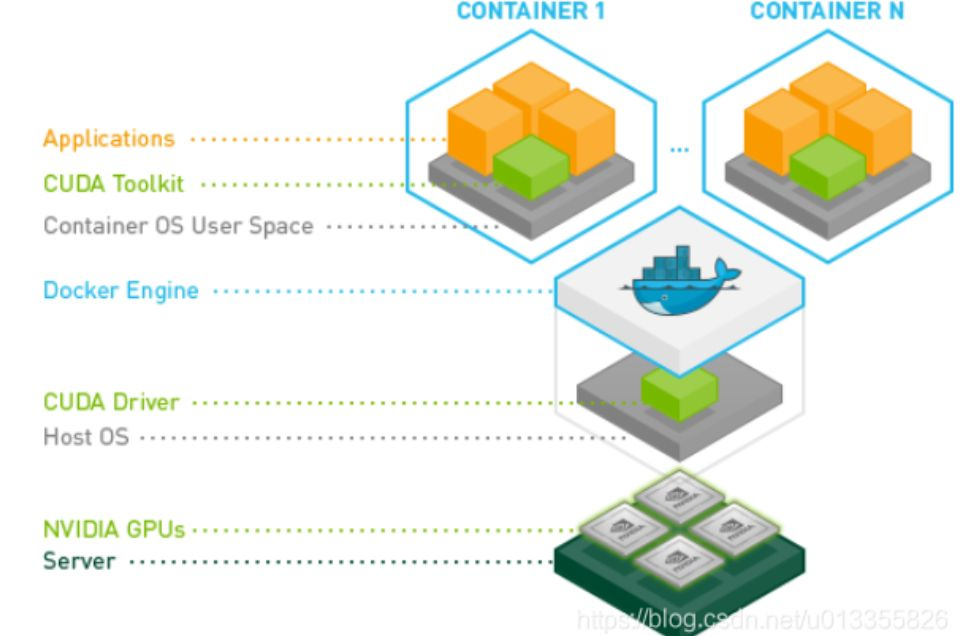

#### 3.Docker安装

```plain
curl http://get.docker.com | sh \ && sudo systemctl --now enable docker
```

这里有要求docker的版本Docker>=19.03

#### 4.Nvidia-docker安装

设置稳定版本库和GPG密钥

```plain
$ distribution=$(. /ect/os-release;echo $ID$VERSION_ID) \ 
   && curl -s -L http://nvidia.github.io/nvidia-docker/gpgkey | sudo apt-key add - \
   && curl -s -L http://nvidia.github.io/nvidia-docker/$distribution/nvidia-docker.list | sudo tee /ect/apt/sources.list
```

在更新软件包列表后，安装nvidia-docker2软件包（以及依赖项）。

```plain
sudo apt-get update
sudo apt-get install -y nvidia-docker2
```

重启（不要忘记！）

```plain
sudo systemctl restart docker
```

文档地址：
[https://docs.nvidia.com/datacenter/cloud-native/container-toolkit/install-guide.html](

#### 5.创建环境

由于spconv给了可以使用的镜像，我们在此处直接进入

```plain
sudo docker run --rm -it --gpus all scrin/dev-spconv:c0f7284c51205f259cb270747259c01cd03cc2ed /bin/bash
```

（--rm表示这个container运行结束后就会被删除，不加会保留）
此镜像配置python3.8、cuda10.2

#### 6.查看spconv版本

docker镜像里面的文件是没法用图形界面看的，只能在终端里敲命令，源代码被放到了/root/spconv目录里

```plain
cd /root/spconv
cat setup.py
```

本组使用的是spconv1.2版本

#### 7.进入docker环境

首次进入（即创建一个docker）

```
sudo docker run --rm -it --gpus all scrin/dev-spconv:c0f7284c51205f259cb270747259c01cd03cc2ed /bin/bash
```

后续进入（进入到原来的docker中）

长ID获取方法从后续步骤中有提到

```
sudo docker start $docker长ID
sudo docker exec -it $docker长ID /bin/bash
```

### Ⅱ pcdet v0.3安装

OpenPCDet在12月又更新了v0.5，但我们在12月前就进行了学习操作，所以这里采用的使OpenPCDet v0.3。

#### 0.Github克隆源代码

```
git clone https://github.com/open-mmlab/OpenPCDet.git
```

此方法可能会因网络问题而失败。

#### 1.在Github上下载到本地后拷贝到环境中

下载链接：[GitHub - open-mmlab/OpenPCDet: OpenPCDet Toolbox for LiDAR-based 3D Object Detection.](https://github.com/open-mmlab/OpenPCDet)

##### 将本地文件拷贝到docker容器中：

- 打开本地环境终端

- 查找容器

  ```
  sudo docker ps -a
  ```

- 获取容器长id

  ```
  sudo docker inspect -f '{{.ID}}' $NAME
  #$NAME为上一步中所查找到的所使用的docker容器的名称
  ```

- 拷贝本地文件到docker容器

  ```
  sudo docker cp 本地文件路径+文件 长ID:容器路径(+文件)
  
  #将docker容器中的文件拷贝到本地
  sudo docker cp 长ID:容器路径+文件 本地路径(+文件) 
  
  #查看docker容器路径方法
  pwd
  #查看本地文件路径方法 右键->属性
  ```

##### 将OpenPCDet-master压缩包解压

```
unzip OpenPCDet-master.zip
```

#### 2.安装anaconda

注：此步骤在库作者文档中不存在，文档中克隆代码后步骤应为安装依赖包，但是由于docker环境中python=3.8导致后续 mayavi安装接连报错，所以采用安装anaconda来改变docker环境.

如果环境python<=3.7可尝试按库作者文档步骤进行。

但建议使用anaconda环境进行。

 - 在annconda官网下载需要的版本 此链接为2020.2版本python=3.7(注意最好不要下载最新版本)
https://repo.anaconda.com/archive/Anaconda3-2020.02-Linux-x86_64.sh
 - 将下载的安装包按上述拷贝OpenPCDet-master的方法从本地下载目录复制到docker目录下
 - cd到安装包所在的docker路径中(复制到/root路径下忽略此步骤)
 - bash+安装包文件名进行安装
 - 重启docker
 - 验证是否安装成功 conda --version查看版本如正常显示则安装成功

#### 3.安装requirements.txt中的包

```
pip install -r requirements.txt
#不建议使用此方法 因为环境中有些包已经安装且可能会报错
```

- 查看已安装的包(基本上是anaconda自带包)

  ```
  conda list
  ```

- torch和torchvision下载

  - 根据cuda版本选择相应的torch版本进行下载

    [Previous PyTorch Versions | PyTorch](https://pytorch.org/get-started/previous-versions/)

    本组采用cuda10.1+torch1.5.0+torchvision0.6.0

  ```
  pip install torch==1.5.0+cu101 torchvision==0.6.0+cu101 -f https://download.pytorch.org/whl/torch_stable.html 
  
  conda install pytorch==1.5.0 torchvision==0.6.0 cudatoolkit=10.1 -c pytorch
  
  #安装过程可能会因网络问题超时 在其后加入
   --default-timeout=1000
  #即
  pip install torch==1.5.0+cu101 torchvision==0.6.0+cu101 -f https://download.pytorch.org/whl/torch_stable.html --default-timeout=1000
  ```

  **注：**如果使用spconv v1.0则下载torch 1.1

  ​        如果使用spconv v1.2则下载torch1.3+ (使用docker则要使torch1.4+)

- 其他包下载

  直接使用pip安装即可(或者conda安装)

  ```
  pip install numba
  ...
  #注意直接安装kornia  pip会安装最新版本导致与torch版本不匹配 
  #如果也使用torch v1.5.0则下载kornia v0.3.0
  pip install kornia==0.3.0
  ```

  **注:** 注意查看numpy版本 使numpy<1.21,>=1.17.否则下一步可能会报错。

#### 4.安装pcdet包

- 切换到OpenPCDet-master路径下 方法：cd+路径

- ```
  python setup.py develop
  ```

### Ⅲ 运行demo

#### 1.下载mayavi

Windows系统下可参考：https://www.zhihu.com/question/383305179 （未尝试，本过程不使用Windows系统，只供后续相关工作参考）

###### Linux系统：

python2环境下可以直接使用pip安装 会将相关依赖包一并下载

```
pip install mayavi
```

python3.7以下可使用以下步骤

```
pip install vtk==8.1.2
pip install mayavi
```

##### 使用anaconda安装：

- 安装vtk 

  - pip安装

  - 官网([Download | VTK](https://vtk.org/download/))下载安装包

    python3.7选择相应版本下载

- 安装mayavi

  [Installation — Viscid 1.0.0 documentation (viscid-hub.github.io)](https://viscid-hub.github.io/Viscid-docs/docs/master/installation.html#installing-mayavi)

  ```
  conda install -c viscid-hub mayavi
  ```

- 在docker环境下需安装libgl1-mesa-gl

  ```
  apt-get update#(每次使用apt-get之前都要进行该步骤)
  apt-get install libgl1-mesa-gl
  ```

- mayavi需要图形化界面包的支持，anaconda自带包pyqt可能不兼容

  ```
  apt-get install python3-pyside
  ```

- 验证mayavi和vtk是否安装成功

  ```
  python
  import vtk
  import mayavi
  ```

  不报错即成功

#### 2.下载KITTI数据集

可在官网下载，但速度慢，建议使用网盘，已整理好。

链接：https://pan.baidu.com/s/1zlM6jOW66-Fhh5S47tbw0A 
提取码：kitt

将数据集按此序列存放：

```
OpenPCDet
├── data
│  ├── kitti
│  │  │── ImageSets
│  │  │── training
│  │  │  ├──calib & velodyne & label_2 & image_2 & (optional: planes) & (optional: depth_2)
│  │  │── testing
│  │  │  ├──calib & velodyne & image_2
├── pcdet
├── tools
```

#### 3.下载预训练模型

可根据库作者文档下载，但可能会有网络不畅通的情况，可使用网盘下载。

链接：https://pan.baidu.com/s/10YEXzpFkp3ezwMbRiKEcjw 
提取码：pvrc

下载好的文件放到/tools路径下

#### 4.运行demo.py

切换到tools路径下

```
python demo.py --cfg_file cfgs/kitti_models/pv_rcnn.yaml \
    --ckpt pv_rcnn_8369.pth \
    --data_path /tools/OpenPCDet-master/data/kitti/training/velodyne/000000.bin
```

以下为可能的报错情况及解决方法：

###### (1)报错： ModuleNotFoundError: No module named 'importlib_resources'

解决：可能是缺少pyface包
pip install pyface 
  -->importlib-resources 5.4.0 需要 zip>=3.1.0
     pip uninstall zipp(2.2.0)
     pip install zipp(3.6.0)

###### (2)报错： ModuleNotFoundError: No module named 'vtkOpenGLKitPython'

原因：vtk安装失败
按照anaconda方法安装mayavi后
          apt-get update(使用apt-get之前必备)
          apt-get install libgl1-mesa-gl
          !!!apt-get install python3-pyside

###### (3)报错: numpy 1.21.4 is installed but numpy<1.21,>=1.17 is required by {'numba'}

更换numpy版本
安装成功

###### (4)报错：qt.qpa.plugin: Could not load the Qt platform plugin "xcb" in "" even though it was found.

This application failed to start because no Qt platform plugin could be initialized. Reinstalling the application may fix this problem.
解决：apt-get install libxcb-xinerama0

###### (5)qt.qpa.screen: QXcbConnection: Could not connect to display  Could not connect to any X display.

解决：vim ~/.bashrc
      加入export QT_QPA_PLATFORM='offscreen'
      source ~/.bashrc

###### (6)ModuleNotFoundError: No module named 'scipy'

解决：pip install scipy

###### (7)ModuleNotFoundError: No module named 'skimage'

解决： pip install scikit-image

### Ⅳ 训练模型

#### 0.坐标转换

使用/pvrcnn/pointconvert.py将自己的.bin点云文件转换为OpenPCDet的标准格式
(cx, cy, cz, dx, dy, dz, heading)

#### 1.统计点云数据

使用/pvrcnn/pc_sum.py统计点云文件数据范围输出final.txt。包含每个点云文件的数据范围。

#### 2.修改kitti_dataset.yaml

修改/tools/cfgs/dataset_configs/kitti_dataset.yaml

第3行，点云范围，根据实际点云范围调整

```python
POINT_CLOUD_RANGE: [0, -40, -3, 70.4, 40, 1] 
```

顺序为[x_min, y_min, z_min, x_max, y_max, z_max]

第65-72行，体素参数，根据点云的稠密程度调整

```python
VOXEL_SIZE: [0.05, 0.05, 0.1] #体素大小
MAX_POINTS_PER_VOXEL: 5 #每个体素的最高点数
      MAX_NUMBER_OF_VOXELS: { #体素数量上限
        'train': 16000,
        'test': 40000
      }
```

#### 3.更改点云数据velodyne

  本组的点云数据文件名叫 pointcloud
  将自己的pointcloud文件放入data/kitti/training
  进入/pcdet/datasets/kitti/kitti_object_eval_python/kitti_common.py
  将第47行代码中的'velodyne'改为'pointcloud'

**注：**1.2.3步骤也可以直接使用kitti数据集 本组使用kitti数据集

​       在使用自己的训练集训练时需要进行训练集的点云标注，可参考[(16条消息) 点云标注工具：1.PCAT_m0_37957160的博客-CSDN博客_点云标注系统](https://blog.csdn.net/m0_37957160/article/details/106333630)


#### 4.训练

切换到/tools路径下

使用的参数 batch_size 和 workers 是2， epochs 是5，储存路径命名为 'mydata_1'

```
python train.py --cfg_file cfgs/kitti_models/pv_rcnn.yaml 
                --batch_size 2 
                --workers 2 
                --epochs 5 
                --extra_tag 'mydata_1'
```

根据实际情况进行修改

#### 5.测试

训练的结果储存在 output/kitti_models/pv_rcnn/default/ckpt
文件是 checkpoint_epoch_5.pth ， batch_size 是2
extra_tag 表示储存路径的一个文件夹名，最好和训练的参数保持一致 

```
python test.py --cfg_file cfgs/kitti_models/pv_rcnn.yaml 
                --batch_size 2 
                --ckpt../output/kitti_models/pv_rcnn/mydata_1/ckpt/checkpoint_epoch_5.pth                 --extra_tag 'mydata_1'
```

#### 6.可视化

使用demo.py中提供的可视化代码

```
python demo.py --cfg_file cfgs/kitti_models/pv_rcnn.yaml 
               --ckpt ../output/kitti_models/pv_rcnn/mydata_1/ckpt/checkpoint_epoch_5.pth                --data_path ../data/kitti/training/pointcloud/Mesh08.bin
```

###### 没有检测到目标 可能报错：

ValueError: zero-size array to reduction operation minimum which has no identity


