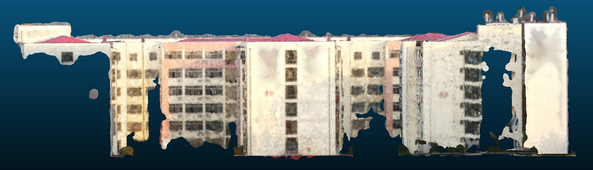

# 图像三维处理的深度学习探讨

到目前为止，本项目主要包括以下内容：
1. 使用深度学习技术对建筑物进行完整的三维重建，无死角、无畸变。
2. 结合计算机视觉课程知识，识别并计算出楼层数目、最高高度、最宽宽度、
最长长度、窗户数目、窗户面积、整个建筑的体积（立方米数）。
3. 识别并计算楼宇外围物体的数目，比如树木、垃圾箱、灯杆、空调外挂机等等。

## 三维重建

### 综述

我们的项目的三维重建部分主要参考了[colmap](http://colmap.github.io/)、[patchmatchnet](https://github.com/FangjinhuaWang/PatchmatchNet)的论文与代码。
我们运用深度学习策略对图像的三维重建主要包括以下步骤：
1. 对图像取特征点
2. 特征点匹配
3. 去除错误匹配点
4. `sfm`恢复相机位姿
5. 稠密重建（也称`mvs`）。
    1.  我们首先尝试传统的稠密重建策略，利用patchmatch算法进行处理；
    2.   之后再使用深度学习方法，我们采用`patchmatchnet`，`CVP-MVSNet`等算法进行处理。

我们实际操作的过程如下：
1. `colmap`处理。我们发现对上面所提到的前4步来讲，深度学习没有太大的优势且效果不尽如人意，于是沿用了传统的处理方式，在对图片进行初步的预处理之后，用`colmap`（`cuda`版）对图像进行处理并进行稀疏重建。
`colmap`中提供了利用传统的`patchmatch`算法进行`dense`重建的选项，为与深度学习对比效果起见，我们也花了一些时间进行传统方法的稠密重建并得出结果。

2. `patchmatchnet`等算法的稠密重建。之后我们参考`patchmatchnet`的代码，利用得到的数据进行稠密重建。
    1. 我们先将我们的数据修改好格式之后，代入`patchmatchnet`代码的作者给出的模型，进行初步的三维重建，这一步因为运算规模较小，所以我们在个人PC上调试成功之后再移植到集群上继续运行；需要注意的一点是，鉴于`patchmatchnet`的源代码要求`cuda`环境而负责本步骤的组员的电脑不支持`cuda`，于是我们将代码改写为可以选择性运行`cuda`或者`cpu`的版本。
    2. 之后我们下载`dtu`数据集，在集群上进行模型的训练，并将上面处理到的数据代入训练出的模型再次尝试进行稠密重建；
    3. 在`patchmatchnet`算法得出结果之后，我们又尝试了`CVP-MVSNet`等算法.
3. 模型处理与表面重建。我们剪裁了一下建筑物周边的数据并利用meshlab等第三方软件对数据进行表面重建。


   <!-- （这一步交给朱朱啦？我毕竟也没做啥） -->

### 如何运行

#### Custom_Evaluation

如果您想用个人的数据代入已知模型查看三维重建的结果，我们建议您在colmap图形化工具中进行automatic reconstruction。

如果您的电脑支持cuda环境，那么我们建议您勾选``dense model``；但勾选与否不影响我们之后的处理过程。
之后，``export model as text``在工作目录的``sparse1``文件夹(请自主创建)下，生成``cameras.txt``、``images.txt``、``points3D.txt``
```
sfm
├──img（您要处理的图片）
├──sparse
├──sparse1
    ├── cameras.txt  
    ├── images.txt   
    └── points3D.txt                                       
    
```
之后我们将项目代码中的``colmap_input.py``文件复制到``sfm``工作目录下并运行，新生成如下内容：
```
sfm
├── images                 
│   ├── 00000000.jpg       
│   ├── 00000001.jpg       
│   └── ...                
├── cams                   
│   ├── 00000000_cam.txt   
│   ├── 00000001_cam.txt   
│   └── ...                
└── pair.txt  
```
我们将上述三部分内容放入项目文件夹的``data``目录下：
```
root directory
├── data                 
│   ├── scan1       
│       ├── cams
        ├── images
        └── pair.txt          
```
于是我们可以开始准备运行了。
如果您自主选择了文件路径，请根据个人情况修改eval.sh；
您可以根据您的情况修改``datasets/custom.py``以及``eval_custom.py``中`img_wh`的值（须被8整除）
设置好之后，通过在终端中键入`sh eval.sh`运行。
倘若您使用windows系统，请在``eval_custom.py``中修改相应参数并直接运行该文件。
生成的结果结构如下所示：
```
outputs_custom
├── confidence                 
│   ├── 00000000.jpg       
│   ├── 00000001.jpg       
│   └── ...                
├── depth_est                   
│   ├── 00000000_cam.txt   
│   ├── 00000001_cam.txt   
│   └── ... 
├── mask                   
│   ├── 00000000_final.png 
│   ├── 00000000_geo.png
│   ├── 00000000_photo.png
│   ├── 00000001_final.png
│   └── ...              
└──  custom.ply
```
其中``custom.ply``即三维重建的点云文件，也即处理后的最终结果，可以使用`colmap`或`meshlab`等软件进行查看或编辑。
我们提供了在集群上用`conda`创建虚拟环境、安装所需模块、运行上述过程的脚本（``eval_cluster.sh``）作为补充；对于可运行cuda的集群，本代码可以并行化运行。

#### 训练模型
 
本代码采用[DTU数据集](https://polybox.ethz.ch/index.php/s/ugDdJQIuZTk4S35)进行训练，数据集格式如下：
```
root_directory
├──Cameras_1
├──Rectified
└──Depths_raw
```
请在下载数据集之后，将``train.sh``中`MVS_TRAINING`改为您的数据集存储路径，并依照您的需要设置`log_dir`（这将是模型结果储存的路径）。

### 运行结果

点云数据的`colmap`与`patchmatchnet`处理结果：

[colmap处理结果](https://pan.baidu.com/s/11UaJ74vQcnfFC1q9BU78cw) (提取码:og6y)

[patchmatchnet处理结果](https://pan.baidu.com/s/11JwJ-VMgWA8e3S2JQCxZTg) 提取码：aldz

我们裁去了最终模型结果中的周边景物，只保留建筑物的结果，得到[最终点云结果](https://pan.baidu.com/s/1oLG-bYXIlJfpmT9IiWpk3w 
)(提取码：6286)，点云截图如下所示：



题目要求：结合计算机视觉课程知识，识别并计算出楼层数目、最高高度、最宽宽度、最长长度、窗户数目、窗户面积。

### 1、计算楼层最高高度、最宽宽度、最长长度

##### 1）选取参照物（本例中选择大门作为参照物），拍摄人站在参照物前的图像，根据人与参照物在图像中的比例，计算出参照物的真实尺寸（如大门的实际高度）。

加载图片，转成灰度图

```
image = cv2.imread("353.jpg")
gray = cv2.cvtColor(image, cv2.COLOR_BGR2GRAY)
```

用Sobel算子计算x，y方向上的梯度，之后在x方向上减去y方向上的梯度，通过这个减法，我们留下具有高水平梯度和低垂直梯度的图像区域。

```
gradX = cv2.Sobel(gray, ddepth=cv2.cv.CV_32F, dx=1, dy=0, ksize=-1)
gradY = cv2.Sobel(gray, ddepth=cv2.cv.CV_32F, dx=0, dy=1, ksize=-1)

gradient = cv2.subtract(gradX, gradY)
gradient = cv2.convertScaleAbs(gradient)
```

去除图像上的噪声。首先使用低通滤泼器平滑图像（9 x 9内核）,这将有助于平滑图像中的高频噪声。低通滤波器的目标是降低图像的变化率。如将每个像素替换为该像素周围像素的均值。这样就可以平滑并替代那些强度变化明显的区域。

然后，对模糊图像二值化。梯度图像中不大于90的任何像素都设置为0（黑色）。 否则，像素设置为255（白色）。

```
# blur and threshold the image
blurred = cv2.blur(gradient, (9, 9))
(_, thresh) = cv2.threshold(blurred, 90, 255, cv2.THRESH_BINARY)
kernel = cv2.getStructuringElement(cv2.MORPH_RECT, (25, 25))
closed = cv2.morphologyEx(thresh, cv2.MORPH_CLOSE, kernel)
closed = cv2.erode(closed, None, iterations=4)
closed = cv2.dilate(closed, None, iterations=4)
```

利用cv2.findContours()函数取得图像的轮廓。cv2.findContours()函数返回两个值，一个是轮廓本身，还有一个是每条轮廓对应的属性。使用cv2.minAreaRect()函数求得包含点集最小面积的矩形，这个矩形是可以有偏转角度的，可以与图像的边界不平行。

```
(cnts, _) = cv2.findContours(closed.copy(), cv2.RETR_EXTERNAL, cv2.CHAIN_APPROX_SIMPLE)
c = sorted(cnts, key=cv2.contourArea, reverse=True)[0]

# compute the rotated bounding box of the largest contour
rect = cv2.minAreaRect(c)
box = np.int0(cv2.cv.BoxPoints(rect))

# draw a bounding box arounded the detected barcode and display the image
cv2.drawContours(image, [box], -1, (0, 255, 0), 3)
cv2.imshow("Image", image)
cv2.imwrite("contoursImage2.jpg", image)
cv2.waitKey(0)
```

找出最上端、最下端、最左端、最右端的点，并以此计算门的长、宽：

```
Xs = [i[0] for i in box]
Ys = [i[1] for i in box]
x1 = min(Xs)
x2 = max(Xs)
y1 = min(Ys)
y2 = max(Ys)
hight = y2 - y1
width = x2 - x1
```


用同样的方法计算人在图像中的尺寸


已知人的实际高度是170cm，计算人的实际高度/人的图像内高度，再用大门的图像内高度乘以这个比例，得到大门在实际中的高度。

```
per = 170/hight2
real_door = per * hight1
print(real_door)
```

得到门的实际高度（单位：cm）：


##### 2）根据建筑物整体的图像，计算参照物与建筑本身在那张图像上的高度和宽度，并根据参照物的实际高度与图像中高度的比例，求得建筑物的真实高度与宽度。

代码同上，得到结果如下：、


得到二者的尺寸分别为（单位：cm）：


求得参照物实际高度（427.68cm）与图像上的高度的比值，分别用楼房在图像中的高度与宽度乘以这个比值，得到楼房的实际尺寸。

```
per = 427.68 / height1
real_height = per * height2
real_width = per * height2
print("楼房高度：",real_height,"楼房宽度",real_width)
```

得到楼房的真实尺寸（单位：cm）：


##### 楼房的长度、8号楼以及22号楼的尺寸可以用同样的方法得出，在此省略。


### 2、识别并计算窗户的数量、面积

```
import numpy as np
import cv2 as cv

font = cv.FONT_HERSHEY_SIMPLEX
```

定义识别函数，并以如下步骤实现要求的功能：

1、分别对图像进行高斯平滑、双边平滑处理图像

2、将图像转化成灰度图

3、得到轮廓，并使用cv.findContours()函数得到轮廓的几何形状

4、遍历所有轮廓，利用：

①边数是否大于等于4条

②面积是否大于50

③形状是否为凸的

三个条件识别轮廓中的矩形并计数

5、计算矩形的总面积，并计算矩形的平均面积

6、利用计算建筑比例时计算出的，同一张图中的，门的实际高度与图中高度的比例，得到窗户的实际面积

```
def find_squares(img):
    squares = []
    img = cv.GaussianBlur(img, (7, 7), 0)
    img = cv.bilateralFilter(img,3,7,7)
    gray = cv.cvtColor(img, cv.COLOR_BGR2GRAY)
    bin = cv.Canny(gray, 150, 100, apertureSize=3)
    contours, _hierarchy = cv.findContours(bin, cv.RETR_EXTERNAL, cv.CHAIN_APPROX_SIMPLE)
    index = 0
    # 轮廓遍历
    sum = 0
    for cnt in contours:
        cnt_len = cv.arcLength(cnt, True)  # 计算轮廓周长
        cnt = cv.approxPolyDP(cnt, 0.02 * cnt_len, True)  # 多边形逼近
        # 条件判断逼近边的数量是否为4，轮廓面积是否大于1000，检测轮廓是否为凸的
        if len(cnt) >= 4 and cv.contourArea(cnt)<1000 and cv.contourArea(cnt) > 50 and cv.isContourConvex(cnt):
            sum += cv.contourArea(cnt)
            M = cv.moments(cnt)  # 计算轮廓的矩
            cx = int(M['m10'] / M['m00'])
            cy = int(M['m01'] / M['m00'])  # 轮廓重心

            cnt = cnt.reshape(-1, 2)
            if True:
                index = index + 1
                cv.putText(img, ("#%d" % index), (cx, cy), font, 0.7, (255, 0, 255), 2)
                squares.append(cnt)
    print("窗户数量为：",index)
    sum = sum/index
    sum = 9.72 * 9.72 * sum
    print("窗户面积为：",sum)
    return squares, img
```

识别窗户的结果：


得到的计数结果、窗户面积为（单位分别为：个、平方厘米）：


### 3、计算楼层的层数

```
import cv2 as cv
```

首先将图像转化为灰度图，再转化为二进制图像

```
def ToBinray():
    global imgray, binary
    # 1、灰度图
    imgray = cv.cvtColor(img, cv.COLOR_BGR2GRAY)
    cv.imshow('imgray', imgray)

    # 2、二进制图像
    ret, binary = cv.threshold(imgray, 127, 255, 0)
    # 阈值 二进制图像
    cv.imshow('binary', binary)
```

输出的灰度图为：


输出的二进制图为


提取轮廓

```
def GetGontours():
    # 1、根据二值图找到轮廓
    contours, hierarchy = cv.findContours(binary, cv.RETR_TREE, cv.CHAIN_APPROX_NONE)
    # 轮廓      层级                               轮廓检索模式(推荐此)  轮廓逼近方法

    # 2、画出轮廓
    dst = cv.drawContours(img, contours, -1, (0, 0, 255), 3)
    #                           轮廓     第几个(默认-1：所有)   颜色       线条厚度

    cv.imshow('dst', dst)
```

结果为


```
if __name__ == '__main__':
    img = cv.imread('24_2.png')
    cv.imshow('img', img)

    ToBinray()  # 转二进制

    GetGontours()  # 提取轮廓

    cv.waitKey(0)
```

依据同上一步中的，识别窗户的原理，计算出楼层数目为：


8号楼、22号楼的楼层数目方法同上。


